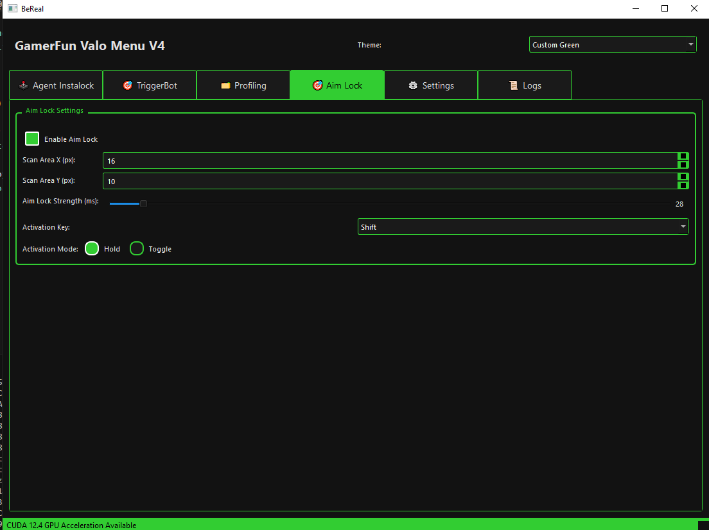

# Valorant Trigger Bot & Spoofer

**Changelog: Version 4.0 (2025-04-22)**

- **NEW: AimLock Module** — Advanced color-based aim assist with toggle/hold modes, adaptive/spiral scan, debug mode, and GPU/CPU support.
- **NEW: Profile System** — Profile editor, import/export, auto profile detection, OCR-based weapon detection, migration, and shortcut mapping.
- **UI/UX:** New tabs for AimLock and Profile, improved settings, debug report generation, and more robust config migration.
- **Performance:** Enhanced benchmarking, robust GPU/CPU switching, improved error handling, and logging.
- **Config:** New keys for aimlock, profile, and advanced settings.
- **Other:** New v4 UI image, more modular codebase (aimlock, triggerbot, shared_scanner).

---

**Disclaimer:**  
This project is for educational and research purposes only. Using this software in online games may violate the game's terms of service and can result in account bans or other penalties. Use at your own risk. The author is not responsible for any misuse or damage resulting from the use of this software.

## Overview

Valorant Trigger Bot & Spoofer is an advanced tool designed to assist players with:
- **Auto Trigger:** Automatically fires when an enemy is on your crosshair, with configurable human-like delays.
- **Insta Lock:** Instantly locks onto the target agent during the selection phase.
- **Advanced Code Spoofing:** Uses AST-based transformation to randomize function names, variable names, and code structure on every run for enhanced undetectability.
- **GPU Acceleration:** Leverages CUDA and PyTorch for high-performance detection, with automatic fallback to CPU if needed.
- **AimLock (NEW in v4):** Advanced color-based aim assist with adaptive and spiral scan, debug mode, and full configurability.
- **Profile System (NEW in v4):** Create, edit, import/export, and auto-detect profiles for different weapons and settings, with OCR-based weapon detection.

The tool features a modern, user-friendly interface (built with PyQt5) that allows you to adjust all settings, including FOV, shooting delay, aimlock parameters, and more.

- **Official Website:** [GamerFun Valorant Trigger Bot, Instant Lock and Spoofer](https://www.gamerfun.club/gamerfun-valorant-trigger-bot-instant-lock-and-spoofer)
- **Official Forum:** [GamerFun Valorant Trigger Bot, Instant Lock and Spoofer](https://forum.gamerfun.club/threads/gamerfun-valorant-trigger-bot-instant-lock-and-spoofer.863/)
- **UnknownCheats Forum:** [[Release] ⭐GamerFun Valo: Valorant Trigger Bot, Instant Lock and Spoofer](https://www.unknowncheats.me/forum/valorant/690063-gamerfun-valo-valorant-trigger-bot-instant-lock-spoofer.html)
- **GitHub Repository:** [valorant-instalock-triggerbot-spoofer](https://github.com/WANASX/valorant-instalock-triggerbot-spoofer)



## Video Demonstration

[](https://www.youtube.com/watch?v=SIrBrGg_BQk)

Watch the full usage and feature demo on YouTube: [Valorant Trigger Bot, AimLock, Insta Lock & Spoofer | GPU & CPU Cheat Video Usage](https://www.youtube.com/watch?v=SIrBrGg_BQk)

## Features

- **Auto Trigger with Dynamic Delay:**  
  Simulates a left mouse click with configurable random delay for more human-like behavior when an enemy is detected.
- **GPU-Accelerated Detection:**  
  Uses CUDA and PyTorch for high-performance color detection, with automatic fallback to CPU.
- **Insta Lock:**  
  Instantly locks onto a target agent during the selection phase (use with caution).
- **Advanced Code Spoofing:**  
  AST-based transformation randomizes code structure, function, and variable names for each run.
- **Smart Acceleration:**  
  Benchmarks and selects the best processing method (GPU or CPU) based on your hardware.
- **Modern Interface:**  
  Thematic options, organized settings, and clear performance indicators.
- **AimLock (NEW in v4):**  
  Advanced aim assist with toggle/hold modes, adaptive/spiral scan, debug mode, and GPU/CPU support.
- **Profile System (NEW in v4):**  
  Profile editor, import/export, auto profile detection, OCR-based weapon detection, migration, and shortcut mapping.
- **Debug Report & Logging (NEW in v4):**  
  Generate debug reports and access detailed logs for troubleshooting.

## New in Version 4.0

- **AimLock:** Advanced aim assist with color detection, adaptive/spiral scan, toggle/hold modes, and debug tools.
- **Profile System:** Create, edit, import/export, and auto-detect profiles for different weapons and settings.
- **UI/UX:** New tabs for AimLock and Profile, improved settings, debug report generation, and more robust config migration.
- **Performance:** Enhanced benchmarking, robust GPU/CPU switching, improved error handling, and logging.
- **Config:** New keys for aimlock, profile, and advanced settings.
- **Other:** New v4 UI image, more modular codebase (aimlock, triggerbot, shared_scanner).

## Requirements

- **Operating System:** Windows 10/11 (64-bit recommended)
- **Python Version:** 3.9+
- **Dependencies:** All required packages are listed in `requirements.txt`.

## Installation

1. **Clone the repository:**
   ```sh
   git clone https://github.com/WANASX/valorant-instalock-triggerbot-spoofer.git
   cd valorant-instalock-triggerbot-spoofer
   ```
2. **Install all dependencies (except PyTorch):**
   ```sh
   pip install -r requirements.txt
   ```
   This will install all required packages except PyTorch. See below for GPU-enabled PyTorch installation.

### ⚡ GPU-Enabled PyTorch Installation (Highly Recommended)

By default, `pip install torch` will install the **CPU-only** version of PyTorch. For best performance, you should install the GPU-enabled version that matches your CUDA version:

- **For CUDA 12.4:**
  ```sh
  pip install torch torchvision torchaudio --index-url https://download.pytorch.org/whl/cu124
  ```
- **For CUDA 11.8:**
  ```sh
  pip install torch torchvision torchaudio --index-url https://download.pytorch.org/whl/cu118
  ```
- **For other CUDA versions:**
  Swap `cu124` for your CUDA version (e.g. `cu121`, `cu118`, etc.) in the URL above. See the [official PyTorch installation guide](https://pytorch.org/get-started/locally/) for more options.

> **Note:** If you are not sure which CUDA version you have, check your NVIDIA driver or use the command `nvcc --version` in your terminal. If you install the wrong version, PyTorch will fall back to CPU mode and you will not get GPU acceleration.

3. **(Optional) If you do not have a compatible GPU, you can skip the above and the menu will run in CPU mode (slower).**

## Mitmproxy CA Certificate Setup (Required for Loader/Network Features)

Some features require HTTPS interception. To set up mitmproxy's CA certificate:

1. **Install mitmproxy:**
   ```sh
   pip install mitmproxy
   ```
2. **Start mitmproxy in a command prompt:**
   ```sh
   mitmproxy
   ```
3. **Open another command prompt and launch Chrome with the proxy: (Make Sure Chrome Is closed)**
   ```sh
   chrome.exe --proxy-server="http://127.0.0.1:8080"
   ```
4. **In Chrome, visit** [http://mitm.it](http://mitm.it)
5. **Download and install the Windows certificate** (follow the prompts).
6. **Close Chrome** after installation is complete.

## Usage

1. **Run as Administrator:**  
   Run the `Main.bat` file with administrator privileges for proper mouse event simulation.

2. **Configure Settings:**  
   Launch the application using `Main.bat`. Use the GUI to adjust settings such as FOV, min/max shooting delay, GPU acceleration, AimLock, and profiles.

3. **Start the TriggerBot:**  
   The TriggerBot is enabled by default. Use the configured hotkey (Alt by default) to activate triggering when enemies are detected.

4. **InstaLock Agent:**  
   Press F5 before entering agent selection to automatically lock your chosen agent.

5. **Code Spoofing:**  
   Every time you run the application, it generates a uniquely randomized version with transformed function names, variable names, and code structure.

6. **Enemy Highlight Color:**
   For best detection, go to Valorant settings and change enemy highlight color to Yellow (protanopia).

## File Structure

- **main.bat:** Launcher script that runs the application with administrator privileges.
- **menu.py:** Contains the core UI, trigger bot logic, and profile/aimlock management.
- **main.py:** Advanced spoofer that transforms menu.py using AST and generates a unique version.
- **aimlock.py:** AimLock module for advanced aim assist (NEW in v4).
- **triggerbot.py:** TriggerBot logic (modularized in v4).
- **shared_scanner.py:** Shared scanning logic for performance (NEW in v4).
- **profiles/**: Directory for user profiles (NEW in v4).
- **config.json:** Configuration file storing user settings.

## Contributing

Contributions are welcome! Feel free to open an issue or submit a pull request for enhancements or bug fixes.

---

## Support & Donations

If you would like to support this project, you can donate **USDT Tron (TRC20)** to:
```
TDiVQzShforoR5XgWXfKuPhPhdgPypXAgB
```

For questions or support, contact **support@gamerfun.club**.

**Note:** This project is intended for research and educational purposes only. Use responsibly and at your own risk.
